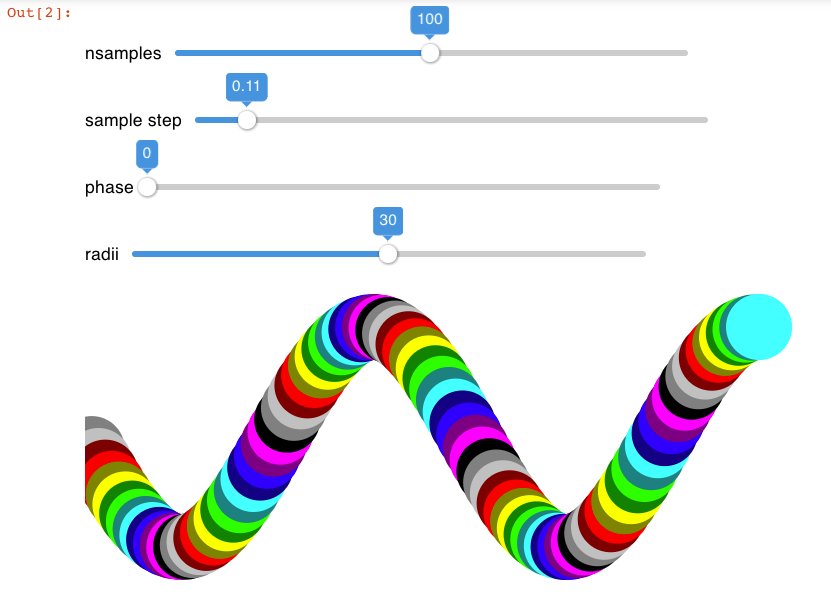
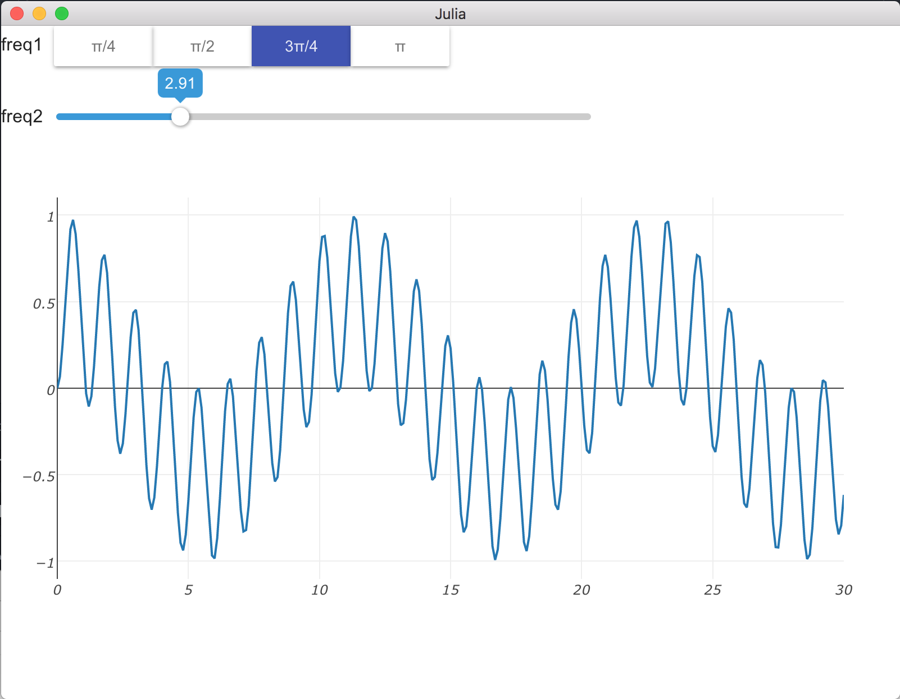

# InteractNext

InteractNext is a lot like [Interact.jl](https://github.com/JuliaGizmos/Interact.jl), except that as well as running in IJulia, it also works in the [Atom/Juno IDE](https://github.com/JunoLab/Juno.jl), in a desktop window with [Blink.jl](https://github.com/JunoLab/Blink.jl), and served in a webpage via [Mux.jl](https://github.com/JuliaWeb/Mux.jl).

Over time InteractNext should hopefully support anywhere Julia can be used to show html/css/js, and feature more widgets than Interact supported, enabling the creation of more detailed and flexible UIs from within Julia.

(The other main difference from Interact.jl is that InteractNext uses [Observables](https://github.com/JuliaGizmos/Observables.jl) instead of Reactive.jl Signals, so you use `obs(w)` instead of `signal(w)` to get the Observable of widget `w`)

### Development Status

This package is new, but should be "working" to a greater or lesser extent in all supported backends (IJulia, Atom, Blink, Mux), so please file issues liberally.

### Install

Currently InteractNext is not in metadata, and neither are a few packages it is built on, so for now installation is:
```
Pkg.clone("https://github.com/JuliaGizmos/WebIO.jl")
Pkg.checkout("Observables")
Pkg.clone("https://github.com/JuliaGizmos/Vue.jl")
Pkg.clone("https://github.com/JuliaGizmos/CSSUtil.jl")
Pkg.clone("https://github.com/JuliaGizmos/InteractNext.jl")
```
If you have those packages already, you'll want to ensure they're on master too, since they're under development atm, so `Pkg.update()` to ensure you're up to date.

Until a proper WebIO release is made, we will need to run a couple of further steps. Firstly [node.js](https://nodejs.org/en/) will need to be installed. And then, run these at a Julia prompt:
```
using WebIO
WebIO.devsetup()
WebIO.bundlejs(watch=false)
```

N.b. the above are just a one-off requirement to install WebIO's javascript files. See [WebIO](https://github.com/JuliaGizmos/WebIO.jl) for more details.

### Examples

The following code is common to the examples below. It creates some svg circle elements
whose centres are sampled from a sine wave.

```julia
using InteractNext

width, height = 700, 300
colors = ["black", "gray", "silver", "maroon", "red", "olive", "yellow", "green", "lime", "teal", "aqua", "navy", "blue", "purple", "fuchsia"]
color(i) = colors[i%length(colors)+1]
ui = @manipulate for nsamples in 1:200,
        sample_step in slider(0.01:0.01:1.0, value=0.1, label="sample step"),
        phase in slider(0:0.1:2pi, value=0, label="phase"),
        radii in 0.1:0.1:60
    cxs_unscaled = [i*sample_step + phase for i in 1:nsamples]
    cys = sin.(cxs_unscaled) .* height/3 .+ height/2
    cxs = cxs_unscaled .* width/4pi
    dom"svg:svg[width=$width, height=$height]"(
        (dom"svg:circle[cx=$(cxs[i]), cy=$(cys[i]), r=$radii, fill=$(color(i))]"()
            for i in 1:nsamples)...
    )
end
```
You can move the sliders
to adjust some of the parameters, and the picture should update. In IJulia it should look like this:


Note, on first running the examples in each backend, the widgets could take
up to 10 seconds to appear, after that first load they should display much
faster.

The nice thing is, you can write this viz code once, and then very
easily display it in IJulia, in a desktop window with Blink, in a plots pane
in Atom, and serve it up in a web page using Mux, like so:

##### IJulia
```julia
display(ui); # or simply have ui be the result of a cell;
```

##### Blink (from the REPL)

```julia
using Blink
w = Window()
body!(w, ui)
```

##### Atom/Juno

```julia
w = get_page()
body!(w, ui)
```

##### Mux (from the REPL)

```julia
using Mux
responder(req) = ui
webio_serve(page("/", responder))
```
Then navigate in your browser to `http://localhost:8000`

You can redefine the `ui` and the `responder` function, then browser refresh to update the page.

### PlotlyJS

The following example uses PlotlyJS, to install it use: `Pkg.add("PlotlyJS")`. It's included here as an example since it's a great plotting package, but also because it needs to be used slightly differently to work well with InteractNext.

#### Plotly Example UI Code

```julia
using InteractNext, PlotlyJS, CSSUtil, DataStructures

x = y = 0:0.1:30
p = plot(x, y)

freqs = OrderedDict(zip(["pi/4", "π/2", "3π/4", "π"], [π/4, π/2, 3π/4, π]))

mp = @manipulate for freq1 in freqs, freq2 in slider(0.01:0.1:4π; label="freq2")
    y = @. sin(freq1*x) * sin(freq2*x)
    restyle!(p, y=[y])
    nothing
end
ui = vbox(mp, p)
```

Below is the code to display it in each of the supported WebIO backends. If
everything is working you should see something like this screenshot using Blink:



and when you click on a button, or move the slider, the plot should update.

#### IJulia
```julia
display.((mp,p));
# or
p.displayed = true # needed until PlotlyJS.jl is better integrated with WebIO.jl
display(ui);
```

#### Blink (from the REPL)

```julia
using Blink
w = Window()
p.view.w = w # needed until PlotlyJS.jl is better integrated with WebIO.jl
body!(w, ui)
```

### Use in Atom/Juno

```julia
w = get_page()
p.view.w = w
body!(w, ui)
```

#### Mux (from the REPL) - Doesn't Work :(

PlotlyJS doesn't support Julia->JavaScript communication in Mux as yet. Once PlotlyJS.jl is better integrated
with WebIO.jl, the following should work:

```julia
using Mux
webio_serve(page("/", req -> ui))
```
